# 🚀 自动部署设置指南

本指南将帮助您配置GitHub Actions自动部署到Cloudflare Pages。

## 📋 前置条件

- ✅ GitHub仓库: https://github.com/Eckes-1/teek-hyde
- ✅ Cloudflare账号ID: `f3785603513c15eb70465410887f13fb`
- ✅ 项目已创建: eckes, eckes-blog

## 🔑 步骤1：获取Cloudflare API Token

1. 登录 [Cloudflare Dashboard](https://dash.cloudflare.com/profile/api-tokens)
2. 点击 **"Create Token"**
3. 选择 **"Custom token"** 创建自定义令牌
4. 配置权限：
   - **Token name**: GitHub Actions Deploy
   - **Permissions**:
     - Account - Cloudflare Pages:Edit
     - Zone - Zone Settings:Read (可选)
   - **Account Resources**: Include - Your Account
   - **Zone Resources**: Include - All zones (或选择特定域名)
5. 点击 **"Continue to summary"** → **"Create Token"**
6. **复制并保存这个Token**（只显示一次！）

## 🔧 步骤2：配置GitHub Secrets

1. 打开您的GitHub仓库: https://github.com/Eckes-1/teek-hyde
2. 进入 **Settings** → **Secrets and variables** → **Actions**
3. 点击 **"New repository secret"**
4. 添加以下两个密钥：

### Secret 1: CLOUDFLARE_API_TOKEN
- **Name**: `CLOUDFLARE_API_TOKEN`
- **Value**: 您在步骤1中获得的API Token

### Secret 2: CLOUDFLARE_ACCOUNT_ID
- **Name**: `CLOUDFLARE_ACCOUNT_ID`
- **Value**: `f3785603513c15eb70465410887f13fb`

## ✅ 步骤3：启用GitHub Actions

工作流文件已创建在 `.github/workflows/` 目录下：

- **deploy-single.yml**: 自动部署到eckes项目（推荐）
- **deploy.yml**: 同时部署到eckes和eckes-blog

默认使用 `deploy-single.yml`，只部署到 eckes 项目。

## 🎯 使用方法

配置完成后，自动部署将在以下情况触发：

1. **推送到main分支时自动部署**
   ```bash
   git add .
   git commit -m "您的提交信息"
   git push github main
   ```

2. **查看部署状态**
   - 访问: https://github.com/Eckes-1/teek-hyde/actions
   - 可以看到部署进度和日志

## 📊 工作流程

```mermaid
graph LR
    A[本地开发] --> B[Git提交]
    B --> C[推送到GitHub]
    C --> D[触发GitHub Actions]
    D --> E[构建项目]
    E --> F[部署到Cloudflare]
    F --> G[网站更新完成]
```



## 🔄 切换部署目标

如果想同时部署到两个项目：
1. 删除 `.github/workflows/deploy-single.yml`
2. 重命名 `deploy.yml` 为默认使用

## ⏰ 预计时间

- 构建时间: 2-3分钟
- 部署时间: 30-60秒
- 全球CDN生效: 1-2分钟

## 🚨 故障排查

### 常见问题

1. **部署失败: Invalid API Token**
   - 检查 CLOUDFLARE_API_TOKEN 是否正确设置
   - 确认Token有Pages编辑权限

2. **部署失败: Project not found**
   - 确认项目名称正确（eckes 或 eckes-blog）
   - 确认Account ID正确

3. **构建失败: Dependencies error**
   - 检查 pnpm-lock.yaml 是否已提交
   - 确认Node版本兼容性

## 📝 测试自动部署

完成设置后，执行以下命令测试：

```bash
# 1. 创建测试文件
echo "# 自动部署测试 $(date)" >> README.md

# 2. 提交并推送
git add .
git commit -m "test: 测试自动部署"
git push github main

# 3. 查看Actions运行状态
# 访问: https://github.com/Eckes-1/teek-hyde/actions
```

## 🎉 完成！

设置完成后，您只需要专注于写作和开发，每次推送代码都会自动部署到：
- 🌐 https://eckes.pages.dev

---

更新时间: 2025-11-16
作者: Eckes
